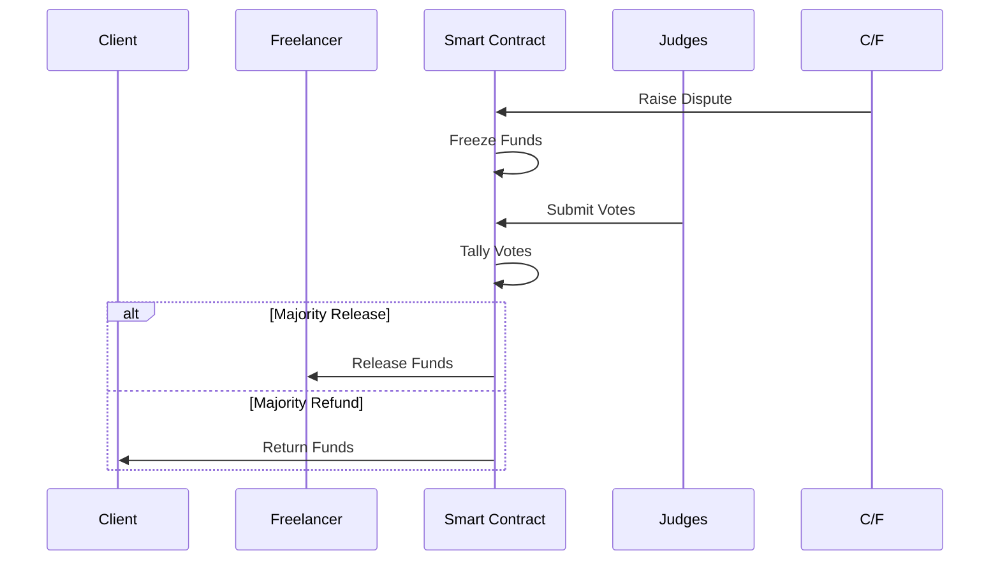

# BitHive - Decentralized Freelance Marketplace

A trustless freelance marketplace leveraging Bitcoin's security through the Stacks blockchain. BitHive enables secure peer-to-peer freelance engagements with built-in escrow, milestone management, and decentralized dispute resolution.

## Table of Contents

- [Overview](#overview)
- [Key Features](#key-features)
- [Smart Contract Details](#smart-contract-details)
- [Workflow](#workflow)
- [Security Considerations](#security-considerations)
- [License](#license)

## Overview

BitHive revolutionizes traditional freelance platforms by implementing:

- Bitcoin-secured transactions via Stacks L2
- Non-custodial escrow system
- Programmatic reputation management
- Community-powered dispute resolution
- Milestone-based payment automation

## Key Features

### 1. Trustless Job Contracts

- STX-backed escrow payments
- Configurable milestone structures
- Auto-release upon completion

### 2. Transparent Bidding System

- Public proposal submissions
- Bidder reputation visibility
- Client-controlled acceptance

### 3. Dispute Resolution Protocol

- Stakeholder-initiated disputes
- Community voting mechanism
- Majority-determined outcomes

### 4. Reputation Management

- 1-5 star rating system
- Average score calculation
- On-chain reputation history

## Smart Contract Details

### Data Structures

#### Job Structure

```clarity
{
    client: principal,
    title: (string-ascii 100),
    description: (string-ascii 500),
    budget: uint,
    status: (string-ascii 20), // "open", "in-progress", "completed", "disputed"
    freelancer: (optional principal),
    milestones: (list 10 uint),
    current-milestone: uint
}
```

#### Dispute Structure

```clarity
{
    initiator: principal,
    reason: (string-ascii 500),
    votes-release: uint,
    votes-refund: uint,
    resolved: bool
}
```

### Core Functions

#### Job Management

| Function     | Parameters                             | Description                 |
| ------------ | -------------------------------------- | --------------------------- |
| `post-job`   | title, description, budget, milestones | Creates new job with escrow |
| `place-bid`  | job-id, amount, proposal               | Submits freelance proposal  |
| `accept-bid` | job-id, freelancer                     | Client accepts bid          |

#### Payment Flow

| Function             | Parameters | Description                     |
| -------------------- | ---------- | ------------------------------- |
| `complete-milestone` | job-id     | Releases next milestone payment |

#### Dispute Management

| Function          | Parameters           | Description                  |
| ----------------- | -------------------- | ---------------------------- |
| `raise-dispute`   | job-id, reason       | Initiates dispute resolution |
| `vote-on-dispute` | job-id, vote-release | Community dispute voting     |

### Reputation System

```clarity
{
    total-rating: uint,
    number-of-ratings: uint,
    average-rating: uint
}
```

- Ratings stored per principal
- Automatic average calculation
- Immutable historical record

### Error Codes

| Code | Description               |
| ---- | ------------------------- |
| u100 | Unauthorized access       |
| u101 | Invalid job ID            |
| u102 | Invalid status transition |
| u103 | Insufficient STX balance  |
| u104 | Duplicate bid attempt     |
| u105 | Existing active dispute   |
| u106 | Invalid rating value      |
| u107 | Maximum bidders reached   |

## Workflow

### Standard Engagement Process

1. **Job Posting**  
   Client deposits STX and defines milestones

2. **Bidding Phase**  
   Freelancers submit proposals (max 100/job)

3. **Contract Award**  
   Client selects freelancer

4. **Milestone Execution**  
   Payments released per completed milestone

5. **Final Rating**  
   Mutual reputation updates

### Dispute Process



## Security Considerations

### Protocol Safeguards

- Bitcoin-finalized transactions
- Time-tested Clarity language
- Escrow non-custodial design
- Maximum bidder limits
- Multi-sig dispute resolution

### Economic Protections

- Full STX escrow requirement
- Milestone amount validation
- Bid amount <= job budget
- Rating spam prevention
